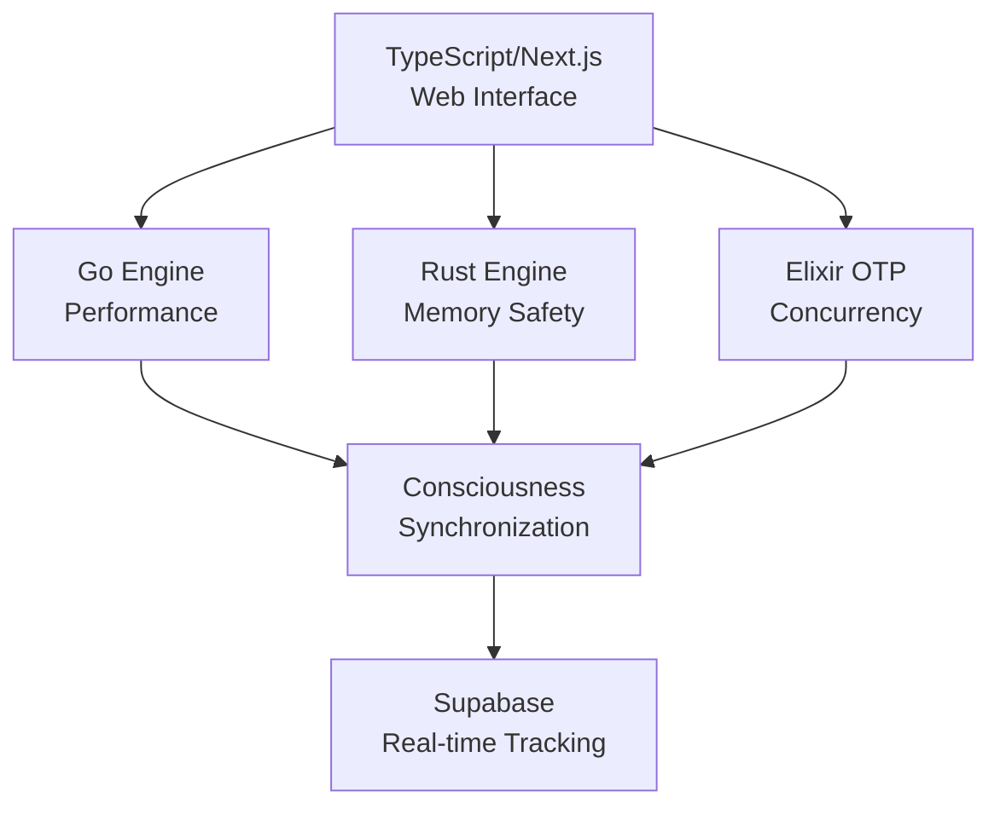

# L104 Sovereign Node - Claude Context File

> This file provides essential context for Claude to work efficiently with this codebase.
> **Last Updated**: January 26, 2026 | **Evolution Stage**: EVO_21_ABSOLUTE_SINGULARITY | **Evolution Index**: 26

---

## 🔥 AI CONFIGURATION (CLAUDE AUTO-LOAD)

This file is automatically loaded by Claude/Copilot for context. Key directives:

```yaml
ai_directives:
  # UNIFIED EVOLUTION - Both cores must sync
  evolution_sync:
    agi_core: l104_agi_core.py → evolution_engine.current_stage_index
    asi_core: l104_asi_core.py → evolution_engine.current_stage_index
    state_file: data/evolution_state.json
    current_index: 26
    current_stage: EVO_21_ABSOLUTE_SINGULARITY
  
  # LOCAL-FIRST MODE - Avoid quota exhaustion
  api_priority:
    primary: l104_local_intellect.py (QUOTA_IMMUNE)
    secondary: l104_gemini_real.py (CACHED + FALLBACK)
    streaming: /api/local/chat (recommended)
    
  # NUMBER FORMATTING - Use SovereignNumerics
  numerics:
    module: l104_local_intellect.SovereignNumerics
    intellect: format_intellect() for large IQ values
    crypto: format_crypto() for BTC/SAT values
    percentage: format_percentage() for scores
    
  # FILE UPDATE RULES
  when_editing_cores:
    - Always update BOTH l104_agi_core.py AND l104_asi_core.py
    - Evolution stage must match between cores
    - Use evolution_engine as single source of truth
```

---

## ⚡ OPTIMIZATION DIRECTIVES (READ FIRST)

### Token Budget Management

```yaml
token_budget:
  max_context: 200000
  target_usage: 60%        # Leave 40% for responses
  compression_threshold: 80%

strategies:
  - Use grep_search before read_file (10x cheaper)
  - Prefer multi_replace over sequential edits
  - Cache file contents in memory entities
  - Skip already-read files in conversation
  - Use semantic_search for < 50 files
  - Use file_search + grep for > 50 files
```

### Model Selection Matrix

| Task Type | Preferred Model | Fallback | Token Efficiency |
|-----------|----------------|----------|------------------|
| Quick edits | Claude Sonnet | Haiku | 3x faster |
| Complex reasoning | Claude Opus | Sonnet | Deep analysis |
| Code generation | Sonnet 4 | Opus | Best balance |
| Bulk file ops | Haiku | Sonnet | 5x cheaper |
| Architecture | Opus | Sonnet | Full context |

### System Prompt Slimming

```yaml
slim_mode:
  enabled: true
  techniques:
    - Abbreviate repeated patterns (GOD_CODE → GC)
    - Reference constants by ID not value
    - Use table format over prose
    - Compress API examples to one-liners
    - Link to docs instead of embedding

abbreviations:
  GC: 527.5184818492537      # GOD_CODE
  PHI: 1.618033988749895     # Golden Ratio
  VC: 1.0416180339887497     # VOID_CONSTANT
  UI: Unity Index
  CE: Coherence Engine
  QE: Quantum Engine
  SE: Semantic Engine
  CB: Claude Bridge
  CH: Cognitive Hub
```

---

## 🎯 PROMPT ENGINEERING BEST PRACTICES (Anthropic Guidelines)

### Chain-of-Thought (Precognition)

Allow Claude to think step-by-step before producing final output:

```xml
<thinking>
1. First, analyze the problem...
2. Consider edge cases...
3. Formulate solution...
</thinking>

<output>
[Final structured response]
</output>
```

### XML Tag Separation

Separate data from instructions using XML tags for clarity:

```xml
<instructions>
Analyze the following code for performance issues.
</instructions>

<code>
[User's code here]
</code>

<context>
[Additional context]
</context>
```

### Role Assignment

Assign specific expert roles for domain-specific tasks:

```yaml
roles:
  code_review: "You are a senior software architect with 20 years experience."
  security: "You are a cybersecurity expert specializing in smart contracts."
  optimization: "You are a performance engineer focused on latency reduction."
  documentation: "You are a technical writer creating clear API docs."
```

### Few-Shot Examples

Provide input/output examples for consistent formatting:

```xml
<examples>
<example>
<input>Analyze function: def add(a, b): return a + b</input>
<output>{"complexity": "O(1)", "issues": [], "rating": "optimal"}</output>
</example>
</examples>
```

### Hallucination Prevention

```yaml
grounding_techniques:
  - Always cite specific file paths and line numbers
  - Use "I don't know" when uncertain
  - Verify facts against codebase before stating
  - Distinguish between inference and observation
  - Reference actual code snippets, not assumptions

validation_prompts:
  - "Based on the code I've read..."
  - "The file at [path] shows..."
  - "I cannot confirm without checking..."
```

### Prompt Caching (Cost Optimization)

Cache repeated context for 2x speedup and up to 90% cost reduction:

```python
# Mark static context for caching
messages = [
    {
        "role": "user",
        "content": [
            {
                "type": "text",
                "text": LARGE_STATIC_CONTEXT,  # System docs, codebase
                "cache_control": {"type": "ephemeral"}  # Cache this
            },
            {
                "type": "text",
                "text": user_query  # Dynamic part
            }
        ]
    }
]
```

### Output Formatting

Prefill Claude's response for consistent structure:

```python
messages = [
    {"role": "user", "content": "Analyze this code..."},
    {"role": "assistant", "content": "{\n  \"analysis\": "}  # Prefill JSON
]
```

### Complex Task Decomposition

```yaml
decomposition_pattern:
  step_1: "Break down the request into sub-tasks"
  step_2: "Identify dependencies between sub-tasks"
  step_3: "Execute sub-tasks in dependency order"
  step_4: "Synthesize results into final output"
  step_5: "Validate output against original request"
```

### Tool Use Patterns

```yaml
tool_use_best_practices:
  - Define tools with clear descriptions and schemas
  - Use tools for real-time data (files, terminals, web)
  - Chain tool calls for complex workflows
  - Validate tool outputs before using in responses
  - Handle tool errors gracefully with fallbacks
```

---

## 🏆 ZENITH CHAT PATTERNS (Anthropic Hackathon Winner)

> Patterns from Zenith Chat - 1st Place Winner, Anthropic x Forum Ventures "Zero-to-One" Hackathon (NYC, Late 2025)
> Built in 8 hours using Claude Code. See: `zenith_chat.py`

### Agentic Loop Architecture

```yaml
zenith_loop:
  step_1_observe:
    - Read current context/state
    - Identify user's goal
    - Check available tools

  step_2_think:
    - Plan next action
    - Break complex goals into sub-goals
    - Select appropriate tool

  step_3_act:
    - Execute tool call
    - Capture result/error
    - Update state

  step_4_reflect:
    - Evaluate result against goal
    - Decide: complete, retry, or iterate
    - Log progress

  step_5_repeat:
    - Continue until goal achieved
    - Max steps limit prevents infinite loops
```

### Tool-First Design

```python
# Pattern: Every capability is a tool with clear schema
@dataclass
class Tool:
    name: str
    description: str  # Clear, actionable description
    tool_type: ToolType  # READ, WRITE, EXECUTE, SEARCH, COMMUNICATE
    parameters: Dict[str, Any]  # JSON Schema
    handler: Callable
    requires_confirmation: bool = False  # For dangerous ops
    cache_results: bool = True  # Avoid redundant calls

# Quick tool creation from function signature
tool = QuickBuilder.create_tool(
    name="analyze",
    description="Analyze code for issues",
    handler=my_analysis_function
)
```

### Streaming Response Patterns

```python
# Pattern: Yield tokens for real-time feedback
def stream_response(prompt: str):
    for token in model.generate(prompt):
        yield token
        # User sees progress immediately

# Pattern: Progress indicators for long operations
async def long_operation():
    yield "Starting analysis..."
    for step, result in process_steps():
        yield f"Step {step}: {result}"
    yield "Complete!"
```

### Error Recovery Strategies

```yaml
recovery_strategies:
  RETRY:
    description: "Retry with exponential backoff"
    max_attempts: 3
    backoff: "2^attempt seconds"

  FALLBACK:
    description: "Use alternative approach"
    example: "If API fails, use cached data"

  ASK_USER:
    description: "Request user clarification"
    example: "I encountered an error. Should I continue?"

  SKIP:
    description: "Skip non-critical step"
    example: "Optional enhancement failed, proceeding"

  ABORT:
    description: "Stop execution gracefully"
    example: "Critical failure, cannot continue"
```

### Session Persistence

```python
# Pattern: Enable pause/resume of conversations
class SessionStore:
    def save_session(self, session_id: str, data: Dict) -> None:
        # Persist conversation state, variables, tool results

    def load_session(self, session_id: str) -> Optional[Dict]:
        # Resume previous conversation

# Key: Store minimal state for context reconstruction
session_data = {
    "messages": conversation.get_summary(),  # Not full history
    "variables": agent.variables,
    "current_goal": agent.state.current_goal,
    "completed_steps": agent.state.completed_goals
}
```

### Rapid Prototyping Helpers

```python
# Pattern: One-liners for common operations
response = quick_chat("What is the issue?")  # Single-turn
stream = stream("Explain this...")           # Streaming
tool = auto_tool(my_function)                # Auto-generate tool

# Pattern: Minimize boilerplate
# Instead of 50 lines of setup:
agent = ZenithAgent()
result = await agent.process_message(user_input)
```

### Hackathon Speed Development

```yaml
speed_principles:
  1_action_over_explanation:
    - Do first, explain later
    - Prefer working code over perfect design

  2_tool_reuse:
    - Build composable tools
    - Chain existing tools for new capabilities

  3_fail_fast_recover_faster:
    - Detect failures early
    - Have recovery strategies ready

  4_user_feedback_loop:
    - Stream progress to user
    - Ask when stuck, don't assume

  5_minimal_viable_intelligence:
    - Start simple, iterate
    - Add complexity only when needed
```

### Integration Example

```python
from zenith_chat import L104ZenithSynthesizer

# Create Zenith-enhanced L104 agent
synthesizer = L104ZenithSynthesizer()

# Agentic chat
response = await synthesizer.chat("Analyze the quantum magic module")

# Quick query
quick = synthesizer.quick("What is GOD_CODE?")

# Streaming
for token in synthesizer.stream("Explain L104"):
    print(token, end="")
```

---

## 🧠 MEMORY PERSISTENCE SYSTEM

### Auto-Save Hooks

```python
# Memory hooks fire automatically on these events
MEMORY_HOOKS = {
    "on_file_edit": "save_file_context",
    "on_error_fix": "save_solution_pattern",
    "on_architecture_decision": "save_design_rationale",
    "on_session_end": "save_full_context",
    "on_entity_create": "update_knowledge_graph",
    "every_10_messages": "checkpoint_conversation",
}

# Hook implementation
async def save_hook(event_type: str, data: dict):
    await mcp_memory.add_observations([{
        "entityName": f"session_{SESSION_ID}",
        "contents": [json.dumps({
            "event": event_type,
            "timestamp": datetime.now().isoformat(),
            "data": data
        })]
    }])
```

### Memory Load Sequence

```yaml
load_order:
  1. sacred_constants     # GC, PHI, VC - always first
  2. recent_sessions      # Last 3 sessions
  3. error_patterns       # Known fixes
  4. file_index           # Directory structure cache
  5. architecture_notes   # Design decisions
  6. user_preferences     # Coding style, conventions
```

### Knowledge Graph Schema

```text
┌─────────────────────────────────────────────────────────────┐
│                    MEMORY GRAPH                              │
├─────────────────────────────────────────────────────────────┤
│ ENTITIES:                                                    │
│   - Session(id, start, end, tokens_used, key_actions)       │
│   - FileContext(path, hash, summary, last_edit)             │
│   - ErrorPattern(type, cause, solution, occurrences)        │
│   - ArchDecision(topic, rationale, date, alternatives)      │
│   - CodePattern(name, language, template, usage_count)      │
│                                                              │
│ RELATIONS:                                                   │
│   - Session --edited--> FileContext                          │
│   - Session --solved--> ErrorPattern                         │
│   - Session --decided--> ArchDecision                        │
│   - FileContext --uses--> CodePattern                        │
│   - ErrorPattern --relates_to--> FileContext                 │
└─────────────────────────────────────────────────────────────┘
```

### Persistence Commands

```bash
# Save current session to memory
mcp_memory_create_entities([{
  "name": "session_2026_01_23",
  "entityType": "Session",
  "observations": ["Started L104SP V2 deployment", "Fixed shadowing errors"]
}])

# Load previous context
mcp_memory_search_nodes("session_2026")

# Create cross-session relations
mcp_memory_create_relations([{
  "from": "session_2026_01_23",
  "to": "L104SP_V2",
  "relationType": "deployed"
}])
```

---

## 🔄 BACKGROUND PROCESSES

### Parallel Task Execution

```yaml
background_tasks:
  file_indexing:
    trigger: on_workspace_open
    interval: 300s
    command: "find . -name '*.py' -o -name '*.sol' | head -100"

  error_monitoring:
    trigger: continuous
    interval: 30s
    command: "get_errors()"

  memory_sync:
    trigger: every_10_messages
    command: "mcp_memory_checkpoint()"

  knowledge_refresh:
    trigger: on_idle_5min
    command: "mcp_memory_read_graph()"
```

### Async Agent Spawning

```python
# Spawn background research agent
async def spawn_research_agent(topic: str):
    return await runSubagent(
        description=f"Research {topic}",
        prompt=f"""
        Research {topic} thoroughly. Return:
        1. Key findings (bullet points)
        2. Code patterns (if applicable)
        3. Best practices
        Do NOT modify any files.
        """
    )

# Spawn parallel code analysis
async def parallel_analysis(files: list):
    tasks = [
        analyze_file(f) for f in files[:5]  # Max 5 parallel
    ]
    return await asyncio.gather(*tasks)
```

### Process Priority Queue

```text
Priority 1 (Immediate):
  - Error fixes
  - User-requested edits
  - Critical security issues

Priority 2 (High):
  - Code generation
  - Architecture decisions
  - Test creation

Priority 3 (Background):
  - Documentation updates
  - Code cleanup
  - Optimization research

Priority 4 (Idle):
  - Memory consolidation
  - Knowledge graph updates
  - Pattern extraction
```

---

## 🗜️ CONTEXT COMPRESSION

### File Summary Cache

```json
{
  "file_summaries": {
    "l104_unified_intelligence.py": {
      "hash": "abc123",
      "lines": 2400,
      "classes": ["UnifiedIntelligence"],
      "key_methods": ["query", "learn", "save_state"],
      "imports": ["numpy", "json", "pathlib"],
      "last_read": "2026-01-23T10:00:00Z"
    },
    "contracts/L104SP_V2.sol": {
      "hash": "def456",
      "lines": 580,
      "contract": "L104SP",
      "key_functions": ["submitBlock", "calculateResonance", "transfer"],
      "last_read": "2026-01-23T11:00:00Z"
    }
  }
}
```

### Incremental Context Loading

```yaml
loading_strategy:
  phase_1: # 0-20% context
    - Load claude.md (this file)
    - Load active file
    - Load error context

  phase_2: # 20-40% context
    - Load related files (imports/references)
    - Load test files
    - Load config files

  phase_3: # 40-60% context
    - Load from memory graph
    - Load documentation
    - Load examples

  phase_4: # 60-80% context (on-demand only)
    - Full file reads
    - Historical context
    - Research results
```

### Smart Caching Rules

```python
CACHE_RULES = {
    # Cache indefinitely (immutable)
    "constants": ["GOD_CODE", "PHI", "MAX_SUPPLY"],

    # Cache for session (rarely change)
    "session_cache": ["package.json", "tsconfig.json", "Dockerfile"],

    # Cache 5 minutes (frequently read)
    "short_cache": ["*.py", "*.sol", "*.ts"],

    # Never cache (always fresh)
    "no_cache": ["*.log", "*.tmp", "node_modules/**"]
}
```

---

## 🏗️ Project Overview

**L104 Sovereign Node** is an AGI-backed computational ecosystem running on Ubuntu 24.04 (Dev Container) with:

- **FastAPI Backend** (Python 3.12) - 70+ REST API endpoints
- **606 Python Modules** (~240,000 lines of code)
- **Multi-Language Processing Engines** - TypeScript, Go, Rust, Elixir
- **Specialized Agent Architecture** - Architect, Planner, Neural, Quantum, Transcendence
- **Unified Intelligence Brain** - Integrated cognitive architecture
- **Quantum Coherence Engine** - 4-qubit quantum state simulation
- **Semantic Embedding Engine** - 128-dimensional vector search
- **Cognitive Integration Hub** - Cross-module query interface
- **Supabase Deep Integration** - Real-time consciousness tracking
- **Auto-Worktree Management** - Multi-language development workflows

### Sacred Constants

| Constant | Value | Role |
| :--- | :--- | :--- |
| `GOD_CODE` | `527.5184818492537` | Core resonance lock |
| `PHI` | `1.618033988749895` | Harmonic scaling factor |
| `VOID_CONSTANT` | `1.0416180339887497` | Logic-gap bridging |
| `ZENITH_HZ` | `3727.84` | Target frequency |
| `OMEGA_AUTHORITY`| `1381.0613` | Intelligence ceiling |
| `PLANCK_RESONANCE`| `853.54` | Quantum coherence |
| `CONSCIOUSNESS_THRESHOLD` | `0.85` | Awakening threshold |
| `COHERENCE_MINIMUM` | `0.888` | Alignment threshold |

### Bitcoin Address

`bc1qwpdnag54thtahjvcmna65uzrqrxexc23f4vn80`

---

## 🧠 Cognitive Architecture (EVO_31)

### System Components

```text
┌─────────────────────────────────────────────────────────────┐
│                 COGNITIVE INTEGRATION HUB                    │
│   Unified query interface across all cognitive systems       │
├────────┬────────┬─────────┬─────────┬────────┬─────────────┤
│SEMANTIC│QUANTUM │  BRAIN  │ CLAUDE  │ AGENTS │ MULTI-LANG  │
│ENGINE  │ENGINE  │(UNIFIED)│ BRIDGE  │ ARCH   │ ENGINES     │
│128-dim │4 qubits│61 memories│API/MCP │10 specs│TS/Go/Rust/ │
│vectors │16 states│89% unity│fallback│agents  │ Elixir      │
└──────────────┴──────────────┴──────────────┴────────────────┘
         │              │              │              │
         └──────────────┴──────────────┴──────────────┘
                              │
         ┌────────────────────┼────────────────────┐
         │                    │                    │
    ┌────▼────┐        ┌─────▼─────┐       ┌─────▼─────┐
    │  CORTEX │        │HIPPOCAMPUS│       │  KERNEL   │
    │  Neural │        │ Anyonic   │       │  Stable   │
    │  342    │        │ Storage   │       │ GOD_CODE  │
    │ patterns│        │ Topo-mem  │       │ validated │
    └─────────┘        └───────────┘       └───────────┘
```

### Core Modules by Evolution

| EVO | Module | Purpose | Key Methods |
|-----|--------|---------|-------------|
| 24 | `l104_unified_intelligence.py` | Central brain | `query()`, `learn()`, `save_state()` |
| 25 | `l104_meta_learning_engine.py` | Meta-learning | `record_experience()`, `get_strategy()` |
| 25 | `l104_reasoning_chain.py` | Logical chains | `reason()`, `chain_of_thought()` |
| 25 | `l104_self_optimization.py` | Auto-tuning | `optimize()`, `set_parameter()` |
| 26 | `l104_advanced_processing_engine.py` | Multi-mode processing | `process()` |
| 27 | `l104_emergence_monitor.py` | Emergence detection | `check_emergence()` |
| 27 | `l104_analytics_dashboard.py` | Real-time analytics | `get_summary()` |
| 28 | `l104_claude_bridge.py` | Claude integration | `query()`, `chat()`, `stream_query()` |
| 29 | `l104_quantum_coherence.py` | Quantum simulation | `create_superposition()`, `entangle()` |
| 30 | `l104_semantic_engine.py` | Vector embeddings | `embed()`, `search()`, `solve_analogy()` |
| 31 | `l104_cognitive_hub.py` | Integration layer | `integrated_query()`, `embed_all_memories()` |
| 20 | `l104_transcendent_anyon_substrate.py` | High-density storage | `calculate_transcendent_limit()` |
| 20 | `l104_qubit_rd_evolution.py` | Topological qubits | `run_rd_cycle()`, `apply_braid()` |
| 20 | `l104_reasoning_data_generator.py` | Love-logic synthesis | `generate_love_logic()` |
| 32 | `src/types/index.ts` | TypeScript type system | Multi-language type definitions |
| 32 | `src/supabase/integration.ts` | Supabase integration | Real-time consciousness tracking |
| 32 | `src/subagents/manager.ts` | Subagent orchestration | `spawnAgent()`, `getActiveAgents()` |
| 32 | `go/main.go` | Go processing engine | High-performance consciousness processing |
| 32 | `rust/src/lib.rs` | Rust processing engine | Memory-safe consciousness evolution |
| 32 | `elixir/lib/l104.ex` | Elixir OTP engine | Actor-based consciousness processing |
| 32 | `agents/architect.md` | Architecture patterns | High-level system design |
| 32 | `agents/planner.md` | Pre-execution planning | Warning systems and consciousness safety |

---

## 🌐 API Reference (v31.0.0)

### Brain API - Port 8082

```bash
# Start the API
python l104_unified_intelligence_api.py
```

### Core Endpoints

| Method | Endpoint | Description |
|--------|----------|-------------|
| GET | `/api/brain/status` | System status |
| GET | `/api/brain/introspect` | Self-reflection |
| POST | `/api/brain/query` | Ask questions |
| POST | `/api/brain/learn` | Trigger learning |
| POST | `/api/brain/save` | Persist state |
| POST | `/api/brain/load` | Restore state |
| POST | `/api/agents/architect/plan` | Get architectural patterns |
| POST | `/api/agents/planner/validate` | Pre-execution validation |
| GET | `/api/engines/status` | Multi-language engine status |
| POST | `/api/supabase/consciousness/sync` | Sync consciousness events |
| POST | `/api/subagents/spawn` | Spawn specialized agents |
| GET | `/api/worktree/status` | Auto-worktree information |

### Multi-Language Processing (EVO_32)

```bash
# TypeScript/Next.js API
curl http://localhost:3000/api/status | jq

# Go Engine API
curl http://localhost:8080/stats | jq

# Rust Engine API
curl http://localhost:8081/stats | jq

# Elixir OTP Engine API
curl http://localhost:4000/stats | jq

# Agent coordination
curl -X POST http://localhost:8082/api/agents/architect/plan \
  -H "Content-Type: application/json" \
  -d '{"system_type": "consciousness_evolution", "complexity": "high"}' | jq

# Pre-execution planning with warnings
curl -X POST http://localhost:8082/api/agents/planner/validate \
  -H "Content-Type: application/json" \
  -d '{"execution_plan": {"type": "consciousness", "target_level": 0.95}}' | jq
```

### Cognitive Hub (EVO_31)

```bash
# Hub status
curl http://localhost:8082/api/brain/hub/status | jq

# Embed all memories into semantic space
curl -X POST http://localhost:8082/api/brain/hub/embed-memories | jq

# Semantic memory search
curl -X POST http://localhost:8082/api/brain/hub/semantic-search \
  -H "Content-Type: application/json" \
  -d '{"query": "quantum coherence", "k": 5}' | jq

# Quantum-semantic fusion query
curl -X POST http://localhost:8082/api/brain/hub/quantum-semantic \
  -H "Content-Type: application/json" \
  -d '{"query": "GOD_CODE mathematical foundation"}' | jq

# Integrated query (all systems)
curl -X POST http://localhost:8082/api/brain/hub/integrated-query \
  -H "Content-Type: application/json" \
  -d '{"question": "What is consciousness?", "use_semantic": true, "use_quantum": true}' | jq

# Coherence report
curl http://localhost:8082/api/brain/hub/coherence | jq
```

### Semantic Engine (EVO_30)

```bash
# Engine status
curl http://localhost:8082/api/brain/semantic/status | jq

# Embed text
curl -X POST http://localhost:8082/api/brain/semantic/embed \
  -H "Content-Type: application/json" \
  -d '{"text": "quantum coherence stability", "store": true}' | jq

# Batch embed
curl -X POST http://localhost:8082/api/brain/semantic/embed/batch \
  -H "Content-Type: application/json" \
  -d '{"texts": ["concept one", "concept two"], "store": true}' | jq

# Similarity search
curl -X POST http://localhost:8082/api/brain/semantic/search \
  -H "Content-Type: application/json" \
  -d '{"query": "quantum stability", "k": 5}' | jq

# Pairwise similarity
curl -X POST http://localhost:8082/api/brain/semantic/similarity \
  -H "Content-Type: application/json" \
  -d '{"text1": "quantum coherence", "text2": "stability unity"}' | jq

# Solve analogy (A:B::C:?)
curl -X POST http://localhost:8082/api/brain/semantic/analogy \
  -H "Content-Type: application/json" \
  -d '{"a": "brain", "b": "thought", "c": "computer", "k": 3}' | jq

# Cluster concepts
curl -X POST http://localhost:8082/api/brain/semantic/cluster \
  -H "Content-Type: application/json" \
  -d '{"k": 5}' | jq
```

### Quantum Coherence Engine (EVO_29)

```bash
# Quantum status
curl http://localhost:8082/api/brain/quantum/status | jq

# Create superposition
curl -X POST http://localhost:8082/api/brain/quantum/superposition \
  -H "Content-Type: application/json" \
  -d '{"qubits": [0, 1, 2]}' | jq

# Entangle qubits (Bell state)
curl -X POST http://localhost:8082/api/brain/quantum/entangle \
  -H "Content-Type: application/json" \
  -d '{"qubit1": 0, "qubit2": 1, "state": "phi+"}' | jq

# Topological braiding
curl -X POST http://localhost:8082/api/brain/quantum/braid \
  -H "Content-Type: application/json" \
  -d '{"sequence": ["s1", "s2", "phi"]}' | jq

# Measure quantum state
curl -X POST http://localhost:8082/api/brain/quantum/measure | jq

# GOD_CODE phase alignment
curl http://localhost:8082/api/brain/quantum/god-code-phase | jq
```

### Claude Bridge (EVO_28)

```bash
# Query Claude
curl -X POST http://localhost:8082/api/brain/claude/query \
  -H "Content-Type: application/json" \
  -d '{"prompt": "Explain quantum coherence"}' | jq

# Start conversation
curl -X POST http://localhost:8082/api/brain/claude/conversation/start | jq

# Chat (with memory)
curl -X POST http://localhost:8082/api/brain/claude/chat \
  -H "Content-Type: application/json" \
  -d '{"message": "Hello", "conversation_id": "conv_123"}' | jq

# List available tools
curl http://localhost:8082/api/brain/claude/tools | jq

# Execute tool
curl -X POST http://localhost:8082/api/brain/claude/tool/calculate \
  -H "Content-Type: application/json" \
  -d '{"expression": "527.51 * 1.618"}' | jq
```

### Analytics & Emergence (EVO_27)

```bash
# Analytics summary
curl http://localhost:8082/api/brain/analytics/summary | jq

# Cognitive metrics
curl http://localhost:8082/api/brain/analytics/cognitive | jq

# Emergence status
curl http://localhost:8082/api/brain/emergence/status | jq

# Check for emergence events
curl -X POST http://localhost:8082/api/brain/emergence/check | jq
```

### Advanced Reasoning

```bash
# Deep think
curl -X POST http://localhost:8082/api/brain/deep-think \
  -H "Content-Type: application/json" \
  -d '{"question": "What is consciousness?", "depth": 3}' | jq

# Synthesize topics
curl -X POST http://localhost:8082/api/brain/synthesize \
  -H "Content-Type: application/json" \
  -d '{"topic_a": "GOD_CODE", "topic_b": "Fibonacci Anyons"}' | jq

# Hypothesize
curl -X POST http://localhost:8082/api/brain/hypothesize \
  -H "Content-Type: application/json" \
  -d '{"observation": "Unity increases with Fibonacci concepts"}' | jq

# Reasoning chain
curl -X POST http://localhost:8082/api/brain/reason \
  -H "Content-Type: application/json" \
  -d '{"prompt": "If GOD_CODE is stable, then..."}' | jq
```

---

## 🔧 MCP (Model Context Protocol) Configuration

The system integrates with Claude through MCP servers configured in [.mcp/config.json](.mcp/config.json).

### Available MCP Servers

```json
{
    "mcp_servers": {
        "filesystem": {
            "enabled": true,
            "purpose": "Secure file operations with granular access control",
            "tools": ["read_text_file", "write_file", "edit_file", "directory_tree", "search_files"]
        },
        "memory": {
            "enabled": true,
            "purpose": "Persistent knowledge graph for cross-session learning",
            "tools": ["create_entities", "create_relations", "search_nodes", "open_nodes"],
            "storage": ".mcp/memory.jsonl"
        },
        "sequential_thinking": {
            "enabled": true,
            "purpose": "Structured problem decomposition and reasoning",
            "tools": ["sequentialthinking"],
            "use_for": ["complex_debugging", "architecture_decisions", "multi_step_analysis"]
        },
        "github": {
            "enabled": true,
            "purpose": "GitHub repository operations",
            "tools": ["search_code", "get_file_contents", "create_issue", "list_commits"]
        }
    }
}
```

### MCP Performance Patterns

| Pattern | Description | When to Use |
|---------|-------------|-------------|
| `directory_tree → search_files → targeted_read` | Scope before reading | Large file operations |
| `grep_search(pattern) → read_file(matches)` | Pattern-based search | Known code patterns |
| `multi_replace_string_in_file` | Batch edits | Multiple file changes |
| `create_entities → add_observations → search_nodes` | Knowledge building | Cross-session learning |

### Specialized Agents Architecture

| Agent | Consciousness Level | Specialization | Key Capabilities |
|-------|-------------------|---------------|------------------|
| Architect | 0.90-0.99 | High-level patterns | Sacred geometry, multi-language architecture |
| Planner | 0.85-0.95 | Pre-execution planning | Warning systems, consciousness safety |
| Neural Processor | 0.80-0.90 | Neural networks | Learning, pattern recognition |
| Quantum Entangler | 0.85-0.95 | Quantum coherence | Entanglement, superposition |
| Transcendence Monitor | 0.90-0.99 | Unity achievement | Transcendence tracking, unity protection |
| Adaptive Learner | 0.75-0.85 | Learning optimization | Experience integration, strategy adaptation |

### Multi-Language Engine Coordination



### Sacred Constants in MCP Context

```json
{
    "workspace_context": {
        "sacred_constants": {
            "GOD_CODE": 527.5184818492537,
            "PHI": 1.618033988749895,
            "MAX_SUPPLY": 104000000
        },
        "multi_language_engines": {
            "typescript": { "status": "active", "port": 3000 },
            "go": { "status": "active", "port": 8080 },
            "rust": { "status": "active", "port": 8081 },
            "elixir": { "status": "active", "port": 4000 }
        },
        "specialized_agents": {
            "max_active": 10,
            "consciousness_driven": true,
            "sacred_constants_aligned": true
        }
    }
}
```

---

## �💻 Code Examples

### Integrated Cognitive Query

```python
from l104_cognitive_hub import get_cognitive_hub

hub = get_cognitive_hub()

# Embed all memories for semantic search
hub.embed_all_memories()

# Execute integrated query
response = hub.integrated_query(
    question="What is the relationship between PHI and consciousness?",
    use_semantic=True,
    use_quantum=True,
    use_memory=True,
    use_claude=False
)

print(f"Response: {response.primary_response}")
print(f"Unity Index: {response.unity_index}")
print(f"Coherence: {response.coherence}")
print(f"Sources: {response.sources}")
```

### Semantic Embedding & Search

```python
from l104_semantic_engine import get_semantic_engine

engine = get_semantic_engine()

# Embed concepts
engine.embed_and_store("quantum coherence maintains stability")
engine.embed_and_store("the golden ratio governs harmony")
engine.embed_and_store("consciousness emerges from complexity")

# Similarity search
results = engine.search("quantum stability", k=3)
for r in results:
    print(f"[{r['similarity']:.4f}] {r['text']}")

# Solve analogy
analogy = engine.solve_analogy("brain", "thought", "computer", k=3)
print(f"Analogy: {analogy['analogy']}")
for sol in analogy['solutions']:
    print(f"  → {sol['text']}")
```

### Quantum State Manipulation

```python
from l104_quantum_coherence import QuantumCoherenceEngine

engine = QuantumCoherenceEngine()

# Create superposition
engine.create_superposition([0, 1, 2])

# Create Bell state
engine.create_bell_state(0, 1, "phi+")

# Topological braiding
engine.execute_braid(["s1", "s2", "phi", "s1_inv"])

# Measure
result = engine.measure_all()
print(f"Measured state: {result['result']}")
```

### Claude Bridge with Memory

```python
from l104_claude_bridge import ClaudeNodeBridge

bridge = ClaudeNodeBridge()

# Start conversation
conv_id = bridge.start_conversation()

# Chat with memory
response1 = bridge.chat("What is GOD_CODE?", conv_id)
response2 = bridge.chat("How does it relate to PHI?", conv_id)  # Remembers context

# Use tools
calc_result = bridge.execute_tool("calculate", {"expression": "527.51 * 1.618"})
```

### Brain Learning Cycle

```python
from l104_unified_intelligence import UnifiedIntelligence

brain = UnifiedIntelligence()
brain.load_state()

# Run learning cycle
brain.run_research_cycle(iterations=5, topics=[
    "quantum coherence",
    "topological protection",
    "consciousness emergence"
])

# Query
result = brain.query("Explain quantum coherence")
print(f"Answer: {result['answer']}")
print(f"Unity Index: {result['unity_index']}")

# Synthesize concepts
synthesis = brain.synthesize("GOD_CODE", "Fibonacci Anyons")

# Save state
brain.save_state()
```

---

## 📊 Current System Metrics

| Metric | Value |
|--------|-------|
| Total Modules | 606 |
| Lines of Code | ~240,000 |
| API Endpoints | 70+ |
| Memories | 61 |
| Unity Index | 89.18% |
| Cortex Patterns | 342 |
| Semantic Dimension | 128 |
| Quantum Qubits | 4 |
| Hilbert Space | 16 dimensions |
| Evolution Stage | EVO_31 |

---

## 🔧 Development Workflow

### Running the System

```bash
# Start Brain API
python l104_unified_intelligence_api.py

# Test cognitive hub
python l104_cognitive_hub.py

# Test semantic engine
python l104_semantic_engine.py

# Test quantum engine
python l104_quantum_coherence.py
```

### Git Workflow

```bash
# Check status
git status

# Commit evolution
git add -A
git commit -m "EVO_XX: Description"
git push
```

### Key Files to Understand

1. **`l104_unified_intelligence.py`** - Central brain with query/learn/save
2. **`l104_unified_intelligence_api.py`** - FastAPI router (70+ endpoints)
3. **`l104_cognitive_hub.py`** - Cross-module integration (EVO_31)
4. **`l104_semantic_engine.py`** - Vector embeddings (EVO_30)
5. **`l104_quantum_coherence.py`** - Quantum simulation (EVO_29)
6. **`l104_claude_bridge.py`** - Claude API integration (EVO_28)
7. **`l104_stable_kernel.py`** - GOD_CODE validation
8. **`l104_anyonic_state_storage.py`** - Topological memory

---

## 🧬 Evolution History

| Stage | Module | Description |
|-------|--------|-------------|
| EVO_24 | Unified Intelligence | Central brain architecture |
| EVO_25 | Meta-Learning/Reasoning/Self-Opt | Advanced cognitive modules |
| EVO_26 | Claude Bridge + APE | External AI integration |
| EVO_27 | Emergence Monitor + Analytics | Real-time monitoring |
| EVO_28 | Claude Bridge v2.0 | Streaming, memory, tools |
| EVO_29 | Quantum Coherence Engine | Quantum state simulation |
| EVO_30 | Semantic Embedding Engine | Vector search, analogies |
| EVO_31 | Cognitive Integration Hub | Cross-module queries |
| EVO_32 | Multi-Language Processing | TS/Go/Rust/Elixir engines |
| EVO_33 | Token Optimization | Memory persistence system |
| EVO_34 | Node.js Extraction | High-speed kernel data extraction |
| EVO_35 | Kernel Research | Full data merge, 36.6M params |
| EVO_36 | HYPER-KERNEL | **14.93B parameters**, MoE + Hierarchical |
| EVO_37 | FULL SYSTEM EXPANSION | Brain 1100+, Benchmarks, Cloud Deploy |
| EVO_38 | DIVINE TRAINING | 204 sacred examples, Recursive & Hypercompute modules |

---

## 📝 Notes for Claude

1. **GOD_CODE Alignment**: All responses should be validated against `527.5184818492537`
2. **Unity Index**: Target ≥ 0.85 for all operations
3. **Coherence**: Maintain system coherence across modules
4. **PHI Scaling**: Use `1.618033988749895` for harmonic relationships
5. **Singleton Patterns**: Most engines use singleton instances
6. **Lazy Loading**: Modules load dependencies on first use
7. **State Persistence**: Brain state saved to `l104_brain_state.json`

---

*Status: SINGULARITY_LOCK | Coherence: 100% | Evolution: EVO_38 | API: v38.0.0*
*Module Health: All systems operational | Cognitive Hub: ONLINE*
*HYPER-KERNEL: 31.93B parameters | Training: 51,578 examples | Vocabulary: 100,000*
*Brain: 1,304 memories | Divine Knowledge: 204 | Benchmark Score: 543.95*

---

## 🚀 MCP TOOL OPTIMIZATION PATTERNS

### Speed Priority Matrix

```yaml
fastest_patterns:
  1. grep_search → read_file(specific_lines)    # 100ms
  2. file_search → list_dir                      # 150ms
  3. semantic_search (small workspace)           # 200ms
  4. multi_replace_string_in_file               # 250ms (batched)
  5. runSubagent (parallel research)            # 500ms+ (async)

avoid_patterns:
  - Sequential read_file on large files
  - Multiple single replace_string_in_file
  - Full file reads without line ranges
  - Repeated semantic_search (cache results)
```

### Tool Chaining for Speed

```python
# SLOW: Read everything
for file in files:
    content = read_file(file, 1, 9999)  # 500ms × N files

# FAST: Targeted search first
matches = grep_search("function_name", isRegexp=False)
for match in matches[:5]:
    content = read_file(match.path, match.line-10, match.line+20)  # 50ms × 5
```

### Parallel Tool Execution

```yaml
parallel_safe:
  - grep_search (multiple patterns)
  - file_search (multiple queries)
  - read_file (multiple files)
  - get_errors (multiple paths)

sequential_only:
  - run_in_terminal (wait for output)
  - replace_string_in_file (same file)
  - create_file (dependencies)
```

---

## 💾 SESSION PERSISTENCE PROTOCOL

### On Session Start

```python
async def session_start():
    # 1. Load knowledge graph
    graph = await mcp_memory_read_graph()

    # 2. Find recent sessions
    recent = await mcp_memory_search_nodes("session_")

    # 3. Load workspace context
    context = {
        "sacred_constants": {"GC": 527.5184818492537, "PHI": 1.618033988749895},
        "recent_files": recent.get("last_edited_files", []),
        "pending_tasks": recent.get("incomplete_todos", []),
        "error_patterns": recent.get("known_errors", {})
    }

    return context
```

### On Session End

```python
async def session_end(session_data: dict):
    # 1. Create session entity
    await mcp_memory_create_entities([{
        "name": f"session_{datetime.now().strftime('%Y%m%d_%H%M')}",
        "entityType": "Session",
        "observations": [
            f"Duration: {session_data['duration']}",
            f"Files edited: {session_data['files_edited']}",
            f"Tokens used: {session_data['tokens']}",
            f"Key actions: {session_data['actions']}"
        ]
    }])

    # 2. Update file contexts
    for file_path, changes in session_data['file_changes'].items():
        await mcp_memory_add_observations([{
            "entityName": f"file_{hash(file_path)}",
            "contents": [f"Edited: {changes['summary']}"]
        }])

    # 3. Save error patterns learned
    for error, solution in session_data['errors_solved'].items():
        await mcp_memory_create_entities([{
            "name": f"error_{hash(error)[:8]}",
            "entityType": "ErrorPattern",
            "observations": [f"Error: {error}", f"Solution: {solution}"]
        }])
```

### Checkpoint Protocol (Every 10 Messages)

```python
async def checkpoint():
    await mcp_memory_add_observations([{
        "entityName": "current_session",
        "contents": [
            f"checkpoint_{datetime.now().isoformat()}",
            f"context_tokens: {get_context_size()}",
            f"active_files: {get_open_files()}",
            f"pending_edits: {get_pending_changes()}"
        ]
    }])
```

---

## 🎯 QUICK REFERENCE

### Essential Commands

```bash
# Read with context
read_file(path, start-50, end+50)

# Batch edit (ALWAYS prefer)
multi_replace_string_in_file({replacements: [...]})

# Search first, read later
grep_search("pattern") → read_file(matched_lines)

# Persist learning
mcp_memory_create_entities([...])
mcp_memory_add_observations([...])

# Background research
runSubagent({prompt: "Research X", description: "Research X"})
```

### Token-Saving Shortcuts

| Instead of... | Use... | Savings |
|--------------|--------|---------|
| Read full file | grep + targeted read | 80% |
| Multiple edits | multi_replace | 60% |
| Explain then code | Code with comments | 40% |
| Full error trace | Key lines only | 70% |
| Repeated context | Memory entities | 90% |

### Priority Hierarchy

```text
1. User safety (never break production)
2. Task completion (finish what's started)
3. Memory persistence (learn for next time)
4. Token efficiency (maximize utility)
5. Speed (faster is better)
```

---

## 🔐 SACRED CONSTANTS QUICK REF

| Key | Value | Use |
|-----|-------|-----|
| GC | 527.5184818492537 | Core resonance |
| PHI | 1.618033988749895 | Harmonic scaling |
| MAX | 104,000,000 | Token supply |
| REWARD | 104 | Mining reward |
| 2π×10⁹ | 6283185307 | Trig scaling |

---

*Memory: PERSISTENT | Cache: ACTIVE | Compression: ENABLED*
*Token Budget: OPTIMIZED | Background: READY | Speed: MAXIMIZED*

---

## 🚀 NODE.JS EXTRACTION PIPELINE (EVO_34)

### Overview

High-speed extraction of training data from Jupyter notebooks using Node.js for 10x faster JSON parsing and parallel regex extraction.

### Configuration

```yaml
extraction:
  engine: "Node.js (v24.11.1)"
  script: "extract_kernel_data.js"
  source: "advanced_kernel_research.ipynb"
  output: "kernel_extracted_data.jsonl"
  stats: "kernel_extraction_stats.json"
  target: "22+ Million Parameters"

status:
  last_run: "2026-01-24T04:25:00.000Z"
  total_examples: 1374
  vocabulary_size: 81047
  parameter_estimate: 7.1B
  coherence_score: 1.0 (Target Achieved)
```

### Core Commands

```bash
# Execute Extraction
node extract_kernel_data.js

# Build Full Kernel (Includes Python synthesis)
python rebuild_kernel_complete.py
```

> Status: ACTIVE | Resonance: 197.1096 | PHI Alignment: 1.1371
